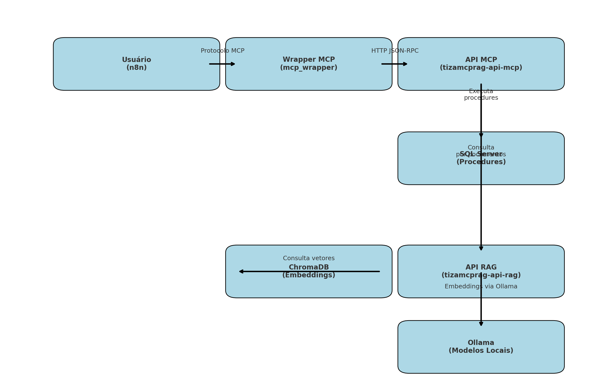

# TizaMcpRag

Projeto que integra execução de MCPs (procedures) e consulta RAG (documentos) com IA local via Ollama.

---

# 🔥 Fluxograma de Comunicação



---

## Serviços Disponíveis

- **n8n**: Orquestração de fluxos
- **api_rag**: Consulta a documentos (RAG)
- **api_mcp**: Execução de procedures SQL
- **ollama**: Servidor de LLMs local

## Pré-requisitos

### Suporte a GPU (Recomendado)

Para melhor performance dos modelos, é recomendado usar GPU. Instale:

1. [NVIDIA Container Toolkit](https://docs.nvidia.com/datacenter/cloud-native/container-toolkit/install-guide.html)
2. Driver NVIDIA atualizado

### Configuração do Banco de Dados

1. Copie o arquivo de exemplo de configuração:
```bash
cp .env.example .env
```

2. Edite o arquivo `.env` com as credenciais do seu banco SQL Server:
```env
DB_SERVER=seu_servidor
DB_DATABASE=seu_banco
DB_USERNAME=seu_usuario
DB_PASSWORD=sua_senha
```

3. Execute o script de criação das procedures:
```bash
# Use seu cliente SQL Server favorito para executar:
sql_server/scripts/create_procedures.sql
```

## Como rodar o projeto

```bash
docker-compose up -d
```

Após iniciar os containers, aguarde alguns minutos para que os modelos do Ollama sejam baixados automaticamente.

## Configuração do n8n

### Instalação do Node MCP

1. Acesse o n8n em `http://localhost:5678`
2. Vá em Settings > Community Nodes
3. Clique em "Add node by providing npm package name"
4. Insira `n8n-nodes-mcp`
5. Se a instalação automática falhar, siga os passos para instalação manual:
   - Copie a pasta `n8n-nodes-mcp` para `.n8n/custom`
   - Reinicie o container do n8n

### Importação do Fluxo

1. No n8n, clique em "Import from File"
2. Selecione o arquivo `scripts/TizaChatBot.json`
3. Ajuste as credenciais e endpoints conforme necessário

## Atualizando documentos RAG

Adicionar documentos em `api_rag/documentos/` e executar:

```bash
docker-compose exec tizamcprag-api-rag python preprocess_docs.py
```

## Modelos do Ollama

O sistema requer os seguintes modelos do Ollama:
- `nomic-embed-text`: para geração de embeddings dos documentos
- `gemma3:latest`: para geração de respostas da API RAG
- `mistral`: para o agente de chat no n8n (requer suporte a tools)

A instalação dos modelos é feita automaticamente na primeira inicialização do sistema.

### Configuração do Agente n8n

Ao importar o fluxo no n8n, configure o nó AI Agent para usar o Ollama:
1. Selecione o nó AI Agent
2. Em "Service", escolha "Ollama"
3. Configure o endpoint: `http://ollama:11434`
4. Selecione o modelo `mistral`

---

## Observações
- Todos os serviços são gerenciados via `docker-compose`.
